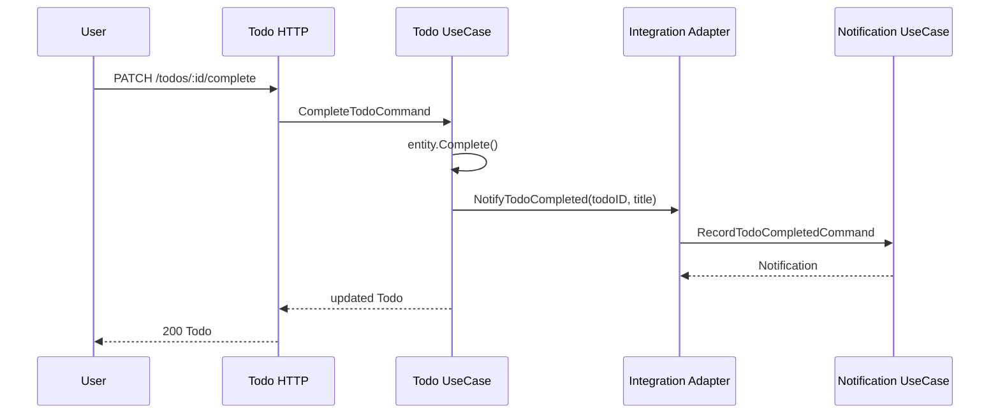

# 主要フロー

## Todo完了時のコンテキスト連携

```mermaid
sequenceDiagram
  participant U as User
  participant H as Todo HTTP
  participant T as Todo UseCase
  participant I as Integration Adapter
  participant N as Notification UseCase

  U->>H: PATCH /todos/:id/complete
  H->>T: CompleteTodoCommand
  T->>T: entity.Complete()
  T->>I: NotifyTodoCompleted(todoID, title)
  I->>N: RecordTodoCompletedCommand
  N-->>I: Notification
  T-->>H: updated Todo
  H-->>U: 200 Todo
```

## 受け入れテスト対象フロー
- Todo作成
- タイトル変更
- Todo完了
- 通知一覧取得（通知コンテキスト）
- 完了一覧取得
- Todo再開
- Todo削除
- 最終一覧0件確認
