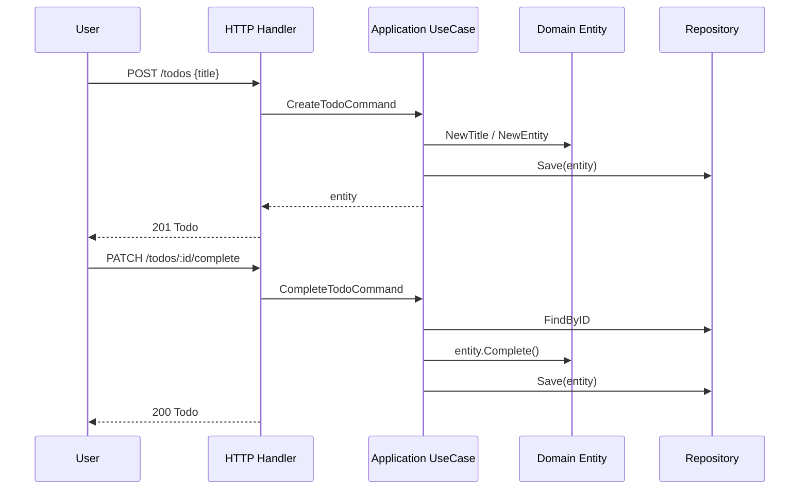

# 主要フロー

## Todo作成から完了まで

```mermaid
sequenceDiagram
  participant U as User
  participant H as HTTP Handler
  participant A as Application UseCase
  participant D as Domain Entity
  participant R as Repository

  U->>H: POST /todos {title}
  H->>A: CreateTodoCommand
  A->>D: NewTitle / NewEntity
  A->>R: Save(entity)
  A-->>H: entity
  H-->>U: 201 Todo

  U->>H: PATCH /todos/:id/complete
  H->>A: CompleteTodoCommand
  A->>R: FindByID
  A->>D: entity.Complete()
  A->>R: Save(entity)
  H-->>U: 200 Todo
```

## 受け入れテスト対象フロー
- 作成
- タイトル変更
- 完了
- 完了一覧取得
- 再開
- 削除
- 最終一覧0件確認
